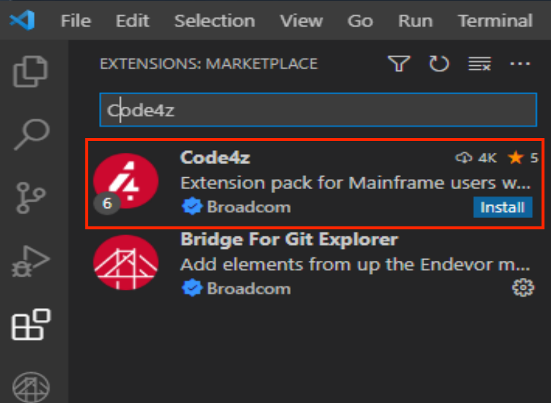
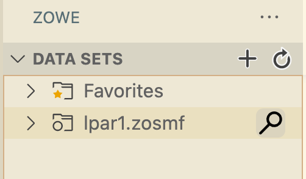

# Doggos application

The application purpose is to count the number of adopted dogs in the particular dog shelter within a working day.

## Description

The application takes the number of the dog adoptions provided to it and generate the report, which can be used later to review the dog shelter activities within the last 24 hours. The report says how many dogs were adopted in the dog shelter per the dog breed.

The application is a simple batch program. It reads the sequential dataset (input) and produces the output sequential dataset (report) as a result. The application written in the plain COBOL language.

## Getting started

### Using Skytap cloud instance
**ID/PW**       **URL**
CRLC03		https://broadcom-md.cmlabs.skytap.com/lab_access/event_participant/1859/7296193a00faef48a0cd45e1239b0c7cfffa67e54def102ea05991d89e929292
CRLC04		https://broadcom-md.cmlabs.skytap.com/lab_access/event_participant/1860/4c446478c5dd89eff45ccc7ae005a8750d0be301fcf8c946983b940c994e35c1
CRLC05		https://broadcom-md.cmlabs.skytap.com/lab_access/event_participant/1861/01260d8f0d94fd06752d0ca333b272c2e2d110d26658d49eb1cd0ea7aab4316c
CRLC06		https://broadcom-md.cmlabs.skytap.com/lab_access/event_participant/1862/35cf6f063bc0dc95817f5eb79f1e2e94a29eb164c42add3baa53889580e9f400
CRLC07		https://broadcom-md.cmlabs.skytap.com/lab_access/event_participant/1863/027f88c3c1a9119516b1437009fa71cad6301cb8acd0c75b9787dc5fcf044df2!

### Dependencies

**Note** You can run it in any OS (Mac, Windows or Linux).

1. You have to have [Npm and NodeJs](https://nodejs.org/en/download/) installed.
   - You can use `node -v` to verify the NodeJs installation in the system.
   - You can use `npm -v` to verify the Npm installation in the system.
2. You have to have [Java](https://jdk.java.net/java-se-ri/11) installed locally.
   - You can follow this [guide](https://gist.github.com/douglarek/bbda8cc23a562cb5d5798717d57bc9e9) to install Java on your machine in case of Mac.
   - You can follow this [guide](https://stackoverflow.com/questions/52511778/how-to-install-openjdk-11-on-windows) to install Java on your machine in case of Windows.
3. You have to have Zowe CLI v1 installed locally with a list of required CLI plugins:
   - [Zowe CLI](https://docs.zowe.org/v1.27.x/user-guide/cli-installcli#installing-zowe-cli-from-an-online-registry): `npm install -g @zowe/cli@6.40.2`.
   - You have to disable to Secure Credential Store in the Zowe CLI: `zowe config reset CredentialManager`(just for the simplicity of the use case).
   - [Zowe Endevor CLI Plugin](https://www.npmjs.com/package/@broadcom/endevor-for-zowe-cli): `zowe plugins install @broadcom/endevor-for-zowe-cli@6.5.0`.
   - [Zowe Bridge for Git CLI Plugin](https://www.npmjs.com/package/@broadcom/endevor-bridge-for-git-for-zowe-cli): `zowe plugins install @broadcom/endevor-bridge-for-git-for-zowe-cli@2.4.1`.
     **Note: we need Zowe CLI with the plugins to be able to communicate with the mainframe and build the source code.**
4. You have to have a [VSCode IDE](https://code.visualstudio.com/) installed locally or it's alternative in the browser.
   **Note: you can have some other IDE instead, but the Broadcom can offer you the full development experience in the VSCode only for now.**
5. You have to have a [Code4z extensions pack](https://marketplace.visualstudio.com/items?itemName=broadcomMFD.code4z-extension-pack) installed in the VSCode.
   **Note: you can also install it in the VSCode interface using this [guide](https://code.visualstudio.com/learn/get-started/extensions).**
   
   

### How to execute VSCode tasks

- Issue the CTRL+SHIFT+P/CMD+SHIFT+P to open a VSCode Command Palette.
- Choose the `Tasks: Run task` option from the list.
- Use the tasks starting with the `DOGGOS` prefix.

### Installing

- Please, use this repository and the `main` branch for the latest source code.

**Note: Make sure, that you have a [Git](https://git-scm.com/downloads) installed.**

- Once you have the repository cloned to your system, please, execute the [VSCode task](#how-to-execute-vscode-tasks) `DOGGOS: install` in it. It is required to get the local project dependencies to be fetched. It may take 1-2 minutes to complete, so please, be patient :)

### Repository structure

- The source code lives in the [GSECONF/DOGGOS folder](./GSECONF/DOGGOS).
- The tests live in the [test/doggos folder](./test/doggos/).

### Building (generating or compiling) the program

Please, use the Endevor Bridge for Git Zowe CLI plugin for this purpose. It will get your source code from the GSECONF/DOGGOS folder and build it in the isolated environment on the mainframe. Everything will be cleaned up automatically afterwards, the other developers won't be affected.

**Note: There is already a backend setup for the build on the mainframe side.**

- You need to use the [VSCode task](#how-to-execute-vscode-tasks): `DOGGOS: create endevor service profile` first, to create an Endevor service profile. **Note: this profile helps us to connect to the Endevor backend environment. You only need to run this task once, the profile will be saved in the file system.**
- You can use the [VSCode task](#how-to-execute-vscode-tasks): `DOGGOS: build the source code` to build the source code.
- Review the task output and the listings in the output directory.

**Note: the building process may end up with no generation. It means that there were no changes in the source code, in that case, try to add some comment into it and rebuild it, just to trigger the build.**

### Run the program manually

Please, use Zowe Explorer VSCode extension for this purpose.

**Note: There is already a backend setup for the run on the mainframe side.**

- Build the program source code successfully using the guide above.
- Configure the local test environment (only once during the initial setup) with this terminal command: `npm run configure`.
  - Enter your mainframe USERID.
- Open Zowe VSCode extension interface: reveal the left column of the VSCode interface and find the big and bold letter Z in there.
- 
- Search for the datasets in the lpar1.zosmf Data Sets profile folder.
  - Navigate to the lpar1.zosmf node and click into it.
  - 
  - Please, use `<USERID>.DOGGOS.*` pattern to search for the datasets.
- Open and modify the `<USERID>.DOGGOS.INPUT` dataset with the required changes, save the file, once you are done.
- Expand the `<USERID>.DOGGOS.JCL` dataset and Right click on the `RUNDOGS` item.
  - Select `Submit JCL` option.
  - 
  - Click into the JobID item in the left bottom corner in the pop notification to see the job results.
    - You can click on the job item several times, until the job will be completed.
    - 

**Note: If you want to run the updated source code, please, rebuild the program using the guide above and submit the JCL again.**

### Run automated tests for the program

Please, use Jest VSCode extension for this purpose.

**Note: There is already a backend setup for the tests on the mainframe side.**

- Build the program source code successfully using the guide above.
- Open the [terminal session](https://code.visualstudio.com/docs/editor/integrated-terminal) in the VSCode.
- Configure the local test environment (only once during the initial setup) with this terminal command: `npm run configure`.
  - Enter your mainframe USERID and password details.
- Open the [test file](/test/doggos/doggos.test.ts) in the VSCode editor and review the test cases if needed.
- Run the tests using the [VSCode task](#how-to-execute-vscode-tasks): `DOGGOS: run tests`.

**Note: If you want to modify the input file for the tests, please, modify [it](/scripts/files/DOGGOS.INPUT) and run the terminal command: `npm run uploadFile` to upload the newer version and test the source code with it. You don't need to rebuild the program source code for it.**

### Debugging the program

Please, use Debugger for Mainframe VSCode extension for this purpose.

**Note: There is already a backend setup for the debug on the mainframe side.**

- Build the program source code successfully using the guide above.
- Open the 'launch.json' file in the .vscode folder in this project.
- Change the USERID with your username with CTRL/CMD+F VSCode shortcut.
- 
- Press F5 to start the debugger session.
- Enter the mainframe password for your username in the popup window.
- Wait a bit for the debugger to be executed and follow the program flow using this [guide](https://marketplace.visualstudio.com/items?itemName=broadcomMFD.debugger-for-mainframe).

**Note: if you want to modify the input file for the debugger, please, use Zowe Explorer extension for this purpose in the guide above.**
